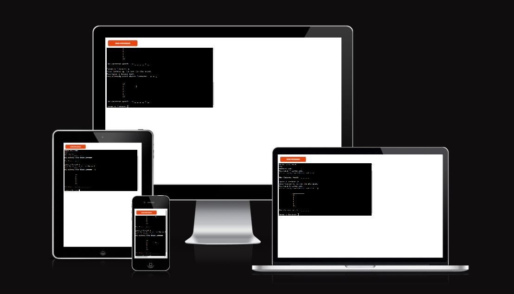
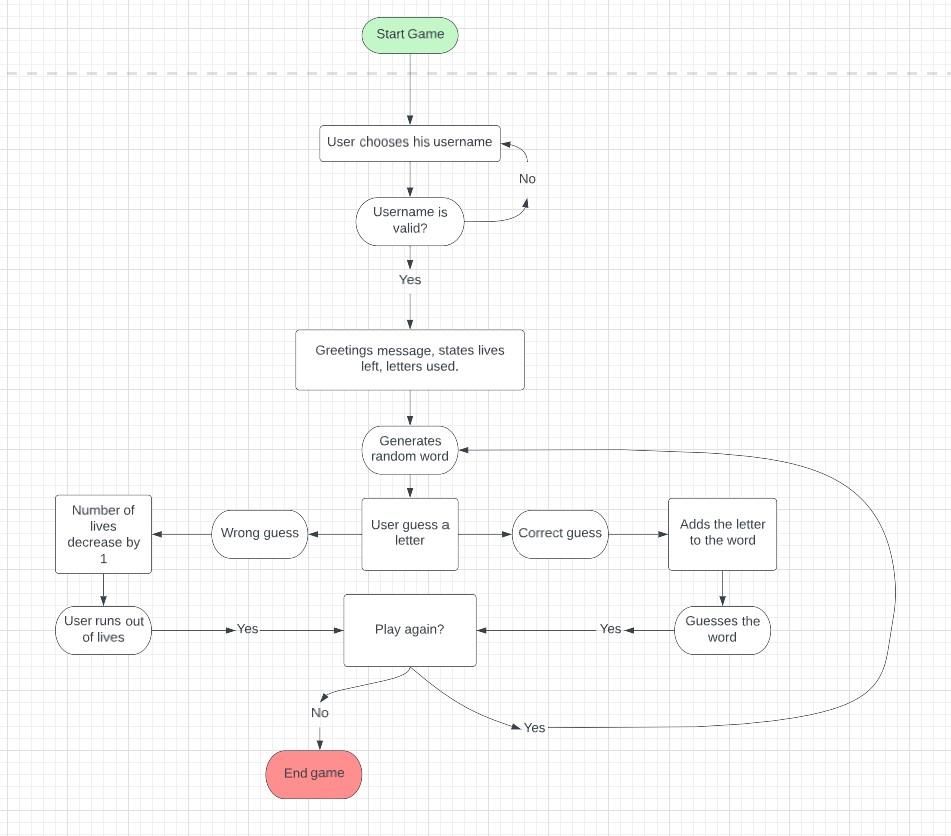
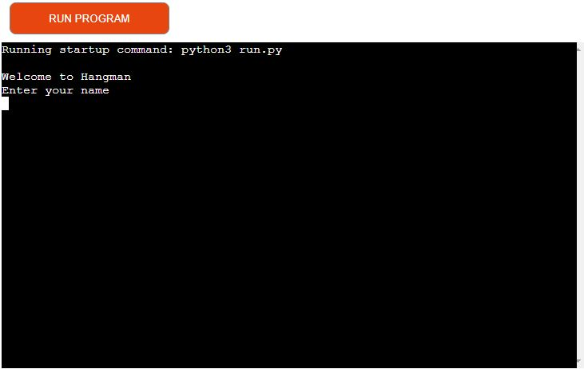
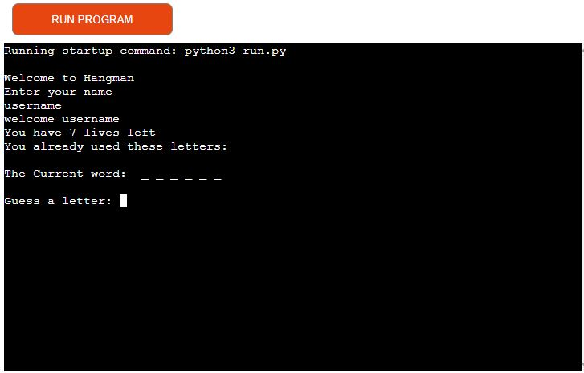
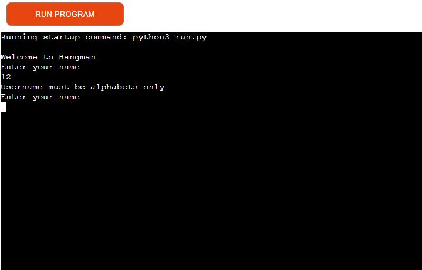
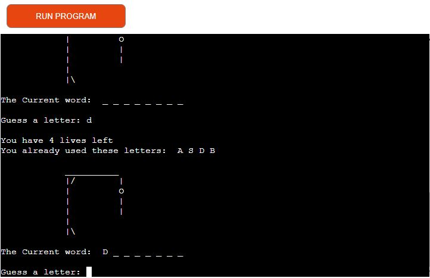
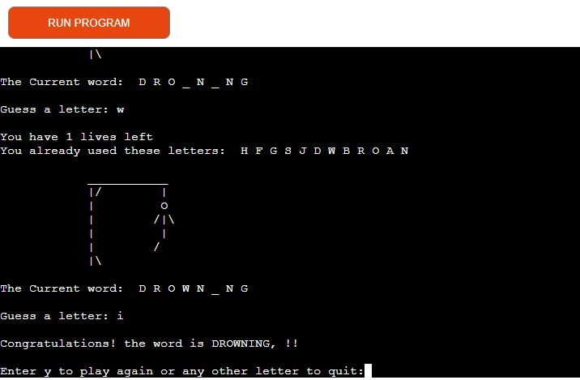
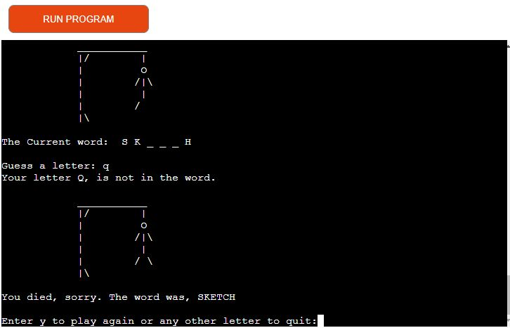
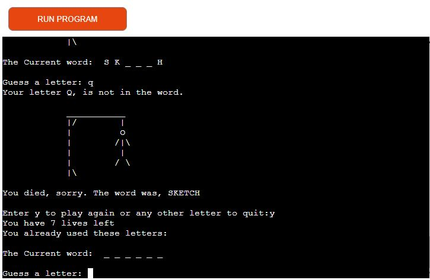
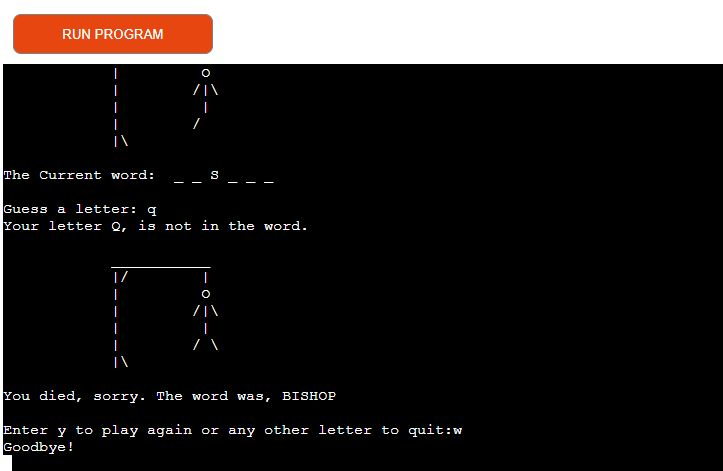

# Hangman Game

[Link to Heroku](https://project-milestone3.herokuapp.com/
)

[GitHub Repo](https://github.com/Vaidots/Project-milestone3)

# Project description 

This is my third milestone project for Code Institute. Hangman game is a Python terminal game, which runs in the Code Institute mock terminal on Heroku.
The word to guess is represented by a row of dashes representing each letter of the word. If the suggested letter is in the word, it is written down, If guessed wrong it will progress the hangman picture and mark the used letter. This process is repeated until the hangman is completed or the user guesses the word.

# Flow chart

[Back to top](#hangman-game)

# Features and User experience

* Greetings message
  * First time user can easily follow the instruction
  * UX: as a first time or returning user, I want to receive a welcoming message.

* Game starts
  * Random word is selected.
  * How many lives/tries player has.
  * Shows how many letters the word has counting "_".
  * UX: as a first time or returning user, I want to see what stage I am at in the game.
  * UX: as a first time or returning user, I want to see how many letters in the word I have to guess.

* Incorrect username
  * The player has to use only alphabetic letters to progress in the game.

* Correct, incorrect guesses or have already guessed messages.
  * The player gets feedback after guessing.
  * UX: as a first time or returning user, I want to receive feedback on my guesses.

* Correct word guess
  * Player receives a congratulations message after guessing the word.
  * Has an option to play again or quit.
  * UX: as a first time or returning user, I want to receive a nice message when won.

* Failing to guess the word
  * Has an option to play again or quit.
  * UX: as a first time or returning user, I want to receive a comforting message when failling to guess the word.

* Play again option
  * User can play again typing letter "y".
  * UX: as a first time or returning user, I want to have a chance to play again.

* Username quits the game
  * User can quit the game by typing any letter except "y" to quit the game
  *  UX: as a first time or returning user, I want to have an option to quit the game.

[Back to top](#hangman-game)

# Future features to implement

* Different difficulity levels
* Create scoring system
* Create categories for users to choose
* Create an option to leave the game at any time

# Technologies Used

* [Python 3.10.8](https://www.python.org/)

* [Git](https://git-scm.com/)

* [GitHub](https://github.com/) 

* [Heroku](https://id.heroku.com/login)

* [LucidChart](https://www.lucidchart.com/pages)

[Back to top](#hangman-game)

# Validation

* Originally meant to validate the code at pep8online.com, however the site was down.

   * Checked in slack community about the issue and found an alternative.
   
1. Run the command pip3 install pycodestyle  Note that this extension may already be installed, in which case this command will do nothing.
2. In your workspace, press Ctrl+Shift+P (or Cmd+Shift+P on Mac).
3. Type the word linter into the search bar that appears, and click on Python: Select Linter from the filtered results (image 1).
4. Select pycodestyle from the list.
5. PEP8 errors will now be underlined in red, as well as being listed in the PROBLEMS tab beside your terminal.

[Back to top](#hangman-game)

# Testing

* Checked if chosing numbers or symbols will get an error telling to use alphabetic letters only.
* Checked if entering correct letter will be shown in the random word space.
* Checked if entering incorrect letter will take a live and progress hangman picture.
* Checked after answering the word or running out of lives gets an option to play again.
* Checked when asked if you want to play again after pressing "y" the player can start guessing again.
* Checked that any other letter pressed will end the game.

[Back to top](#hangman-game)